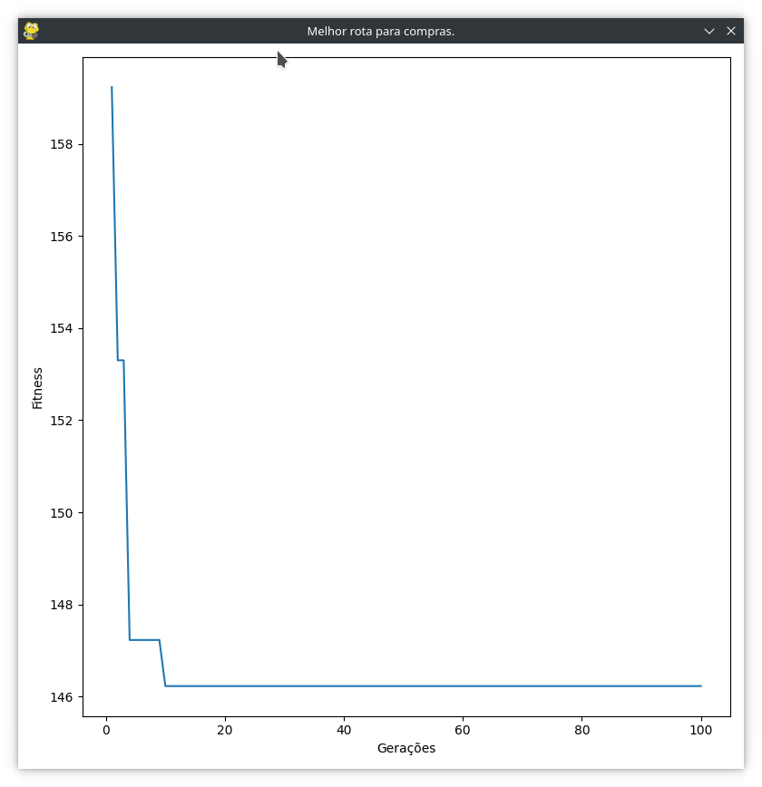

# FIAP_IA_PARA_DEVS_TECH_CHALLENGE
Repositório dos techs challenges do grupo da pós graduação da FIAP IA para DEVS.

****
# TECH CHALLENGE - 1IADT - Fase 2
##### Caminho
FIAP_IA_PARA_DEVS_TECH_CHALLENGE/Tech_Challenge_Fase_02/

* Créditos:

### Grupo 12
#### Componentes
* Silas Pereira Costa - RM355822
* Wesley Gomes Santos - RM355677

### Definição do Problema

A empresa SIA iria realizar uma confraternização de fim de ano para os seus funcionários e precisava comprar os itens para o evento da forma mais otimizada e com o menor custo possível. 
Para isso, contratou um motoboy para realizar a compra dos itens, passando por alguns super mercados da região, buscando o menor preço e no menor tempo possível, pois o evento seria no dia seguinte. 
Para o motoboy conseguir atender e rentabilizar mais o seu retorno, deve realizar a rota mais otimizada para economizar no combustível e no tempo entre os supermercados para verificar os preços.
A capacidade da moto é de 40kg e ele só poderá realizar uma única viagem.
O tempo limite da viagem é de 100 minutos.

### Testes e Resultados: 

* Realizamos um teste com 100 gerações com 10 caminhos iniciais (indivíduos).
* Podemos observar que o melhor resultado foi encontrado próximo da 16° geração.
* Segue abaixo o resultado obtido com o código:

### Documentação do Projeto: 

#### O código da Solução em Python
Uma implementação de algorítmo genético com funcionalidades para tratar uma matriz de tempo entre cidades com o código de cruzamento Ordered Crossover (OX1) através da evolução entre indivíduos (caminhos) e elitismo.

##### Descrição de classes:

* caminho.py
    * Contém a classe Caminho (indivíduo), que contém funcionalidades inerentes ao indivíduo.

* caminhos.py
    * Contém a classe Caminhos (população), que contém funcionalidaes inerentes a população.

* dados.py
    * Responsável pela leitura e montagem da estrutura de dados utilizada pelo projeto.

* exceptions.py
    * Contém as exceções personalizadas utilizadas pelo projeto.

* genetico.py 
    * Gerenciador de funcionalidades genéticas, responsável pelo controle da evolução dos indivíduos (caminho)
    * Controle da geração do gráfico de evolução das gerações.

* gera_grafico.py
    * Montagem do gráfico de evolução das gerações.

* main.py
    * Classe inicial responsável pelas chamadas iniciais às demais classes do projeto
    * Efetua a impressão do melhor indivíduo (caminho).

##### Detalhamento do código da solução:

* ###### caminho.py

Contém a classe Caminho (indivíduo), que contém funcionalidades inerentes ao indivíduo.

Funcionalidades:
* Construtor: coordena a geração incial de caminhos válidos a partir de repetição de tentativas na aleatoriedade de super mercados.

* Geração de rotas de supermercados (gerar_rota_super_mercado()): Realiza a geração de rotas dos supermercados.

* Mutação (mutacao()): 
    * Com um percentual randômico a mutação será gerada a partir da troca de genes (supermercado) do indivíduo (caminho).
    * Realização da chamada da validação do caminho.

* Geração de relatório (gerarRelatorio()): Efetua a montagem do relatório final com os dados do próprio caminho, contendo o detalhamento do mesmo.

* Mapeamento de produtos baratos encontrados pelo caminho (procurar_produtos_baratos_caminho()): Responsável por iterar na lista de supermercados passados pelo caminho e mapear os produtos mais baratos encontrados.

* Cálculo do valor total (valor_total()): Efetua o somatório dos produtos mais baratos encontrados pelo caminho.

* Cálculo da eficiência (eficiencia()): Efetua o cálculo da eficiência somando o o tempo total do caminho com o valor total.

* Cálculo do peso total (get_peso_total()): Somatório do peso dos produtos mais baratos selecionados.

* Cálculo do tempo do caminho (calcular_tempo_caminho()): Efetua o cálculo do tempo de deslocamento entre os supermercados do caminho.

* Cálculo do tempo de coleta do produto (calcular_tempo_produto()): Calcula o tempo de coleta de cada produto no em cada supermercado passado pelo caminho.

* Cálculo do tempo total (calcular_tempo_total()): Calcula o tempo total entre os supermercados do caminho e soma o tempo de coleta dos produtos.

* Calculo da distância do caminho (calcular_distancia_caminho()): Calcula o somatório da distância do caminho entre os supermercados.

* Identificação de supermercados sem compras (identificar_super_mercado_sem_compra): Identifica ocorrência de supermercados no caminho que não tem necessidade de comprar produtos.

* Cálculo do fitness (fitness()): Efetua a validação do caminho, modifica o status de validade e calcula a eficiência.

* ###### caminhos.py

Contém a classe Caminhos (população), que contém funcionalidades inerentes a população.

Funcionalidades:
* Construtor: 
    * Define a quantidade de caminhos (indivíduos) iniciais.
    * Cria os indivíduos iniciais.

* Gerenciamento da mutação (mutacao()): Controla a mutação da população.

* Seleção dos melhores caminhos (indivíduos) da poupulação (elitismo) (top()): 
    * Efetua a filtragem dos caminhos (indivíduos) válidos
    * Seleciona os dez primeiros caminhos (indivíduos) com melhor eficiência.

* Gerenciamento da seleção dos melhores caminhos (indivíduos) entre populações (selecionar()): 
    * Mescla as populações
    * Efetua a filtragem dos caminhos (indivíduos) válidos
    * Seleciona os dez primeiros caminhos (indivíduos) com melhor eficiência.

* Gerenciamento do cruzamento dos parentes (cruzar()): Efetua o cruzamento dos parentes com a o algoritmo Ordered Crossover (OX1).

* Gerenciamento do crossover (crossover()): Gerencia o cruzamento da população.

* ###### dados.py

Contém a classe Dados, que contém funcionalidades do gerenciamentos dos dados da aplicação.

Funcionalidades:
* Construtor: Efetua o controle das chamadas das funcionalidade de carga de dados da aplicação.

* Importador de lista de rotas de supermercados (gerar_rotas_super_mercados()): Realiza a leitura do arquivo super_mercados.csv e mapeia as rotas entre eles.

* Importador de supermercados (gerar_lista_super_mercados()): Constroi a estrutura inicial contendo os supermercados e o vetor de produtos (vazio).

* Importador de produtos (gerar_lista_produtos()): Efetua a importação dos produtos contidos no arquivo produtos.csv e os mapeia por super mercados em um vetor de produtos.

* ###### exceptions.py

Contém as classes exceção de validação de fitness filhas da classe Exception. São elas: 

* FitValidacaoException(Exception)
* TempoDecorridoException(FitValidacaoException)
* PopulacaoInexistenteException(FitValidacaoException)
* PesoException(FitValidacaoException)
* SuperMercadoSemCompraException(FitValidacaoException)

* ###### genetico.py

Contém a classe Genetico, responsável pelo controle genético da população (caminhos).

Funcionalidades:
* Construtor: Responsável por definir a quantidade de gerações máximas a serem iteradas no processamento.

* Quantidade de gerações (qtd_geracao()): Responsável por informar a quantidade de gerações atuais.

* Quantidade de evoluções (qtd_evolucao()): Informa a quantidade de evoluções.

* Controle genético da população (caminhos) (executar()): Efetua o controle das gerações e suas evoluções, cruzamentos, mutações.

* Geração de gráfico das gerações (gerarGrafico()): Efetua o gerenciamento do gráfico a ser gerado contendo os dados das gerações.

* ###### main.py
    Classe inicial responsável pelas chamadas iniciais às demais classes do projeto
    Efetua a impressão do melhor indivíduo (caminho).

#### Execução:
Faça o clone do projeto em um diretório a sua escolha
Instale o python 3.12 ou superior

#### Linux 
* Se o python for 3.12 na distribuição por padrão:
    * $ sudo apt install python3-venv 
    * $ sudo apt install python3-pip
* Senão:
    * $ sudo apt install python3.12-full
    * $ sudo apt install python3.12-venv
    * $ sudo apt install python3.12-pip

$ python3 -m venv FIAP_IA_PARA_DEVS_TECH_CHALLENGE/Tech_Challenge_Fase_02/venv

$ source FIAP_IA_PARA_DEVS_TECH_CHALLENGE/Tech_Challenge_Fase_02/venv/bin/activate

$ pip install -r requirements.txt
